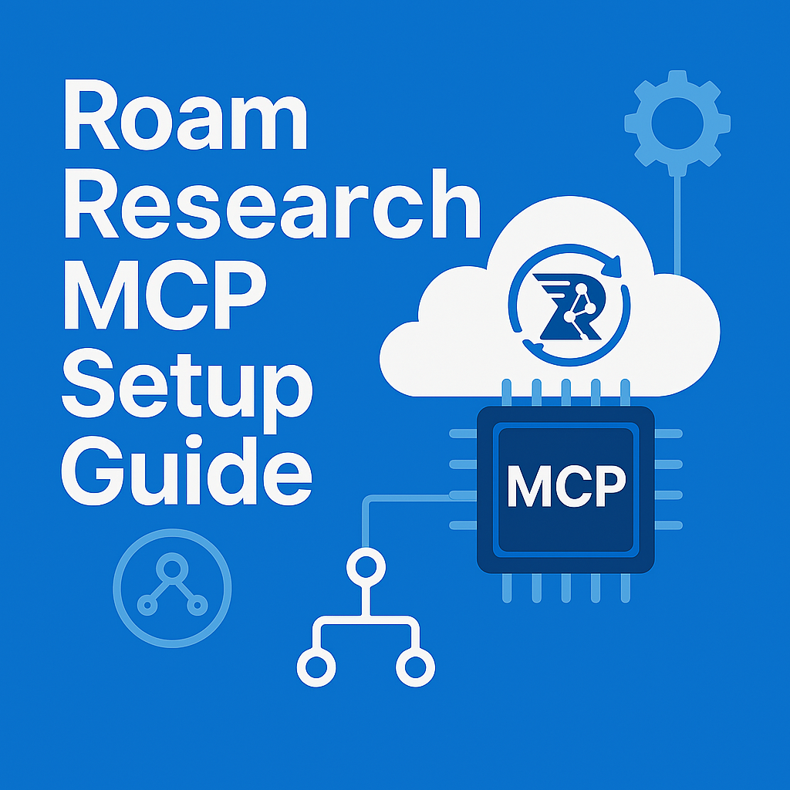
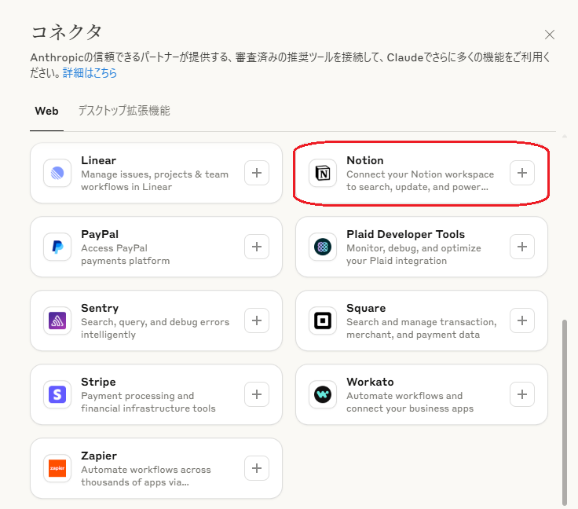
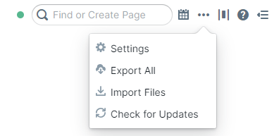
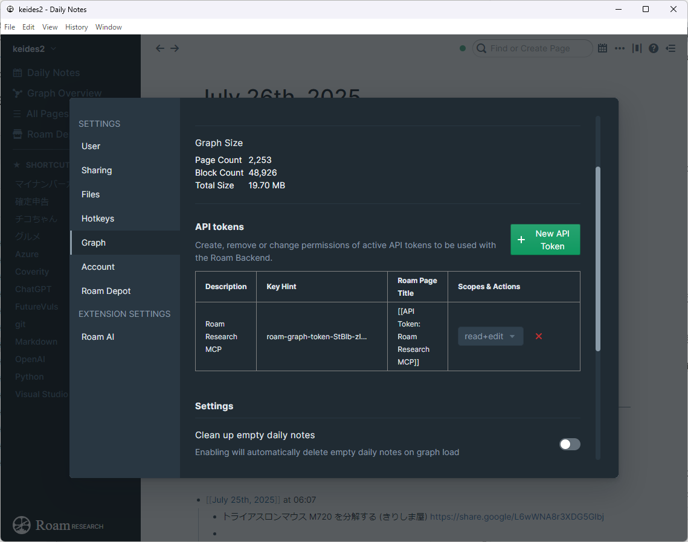

# Roam Research MCP Setup Guide (Windows)

**English | [日本語](README_ja.md)**



> **📋 About this Guide**  
> This repository is a supplementary guide for integrating [2b3pro/roam-research-mcp](https://github.com/2b3pro/roam-research-mcp) with Claude Desktop on Windows.

[](https://opensource.org/licenses/MIT)
[](https://nodejs.org/)
[](https://www.microsoft.com/windows/)

## 🚀 Quick Start

1. [Generate Roam Research API Token](#roam-research-setup)
2. [Install Node.js](#nodejs-setup)
3. [Set up the MCP Server](#mcp-server-installation)
4. [Configure Claude Desktop](#claude-desktop-setup)
5. [Verify Operation](#verification)

## 🔧 Issues This Guide Solves

- ❌ **JSON Parse Errors**: `Unexpected token 'R', "RoamServer"... is not valid JSON`
- ❌ **Environment Variable Errors**: `Missing required environment variables`  
- ❌ **ES Module Issues**: Problems with `require()` usage
- ✅ **Stable Claude Desktop Integration**

This is a supplementary guide for the [Roam Research MCP Server](https://github.com/2b3pro/roam-research-mcp) that connects the note-taking app `Roam Research` (known as a "second brain") with `Claude Desktop` using `MCP` (Model Context Protocol).

While `Notion`, another note-taking app, has an MCP server provided by `Anthropic` as a trusted partner standard offering:



The [Roam Research](https://roamresearch.com/) MCP server is not currently provided by `Anthropic`, so we obtain it from GitHub at [https://github.com/2b3pro/roam-research-mcp](https://github.com/2b3pro/roam-research-mcp).

Following the `Installation and Usage` section's `Running with Stdio` instructions, several issues occurred during Claude Desktop integration. This guide provides specific steps to address these problems.

Below, we explain the background of this guide and the main differences from the settings and procedures in the `2b3pro/roam-research-mcp` repository.

## Background of This Guide

This `Roam Research MCP` server provides a standardized interface for the AI assistant `Claude Desktop` to access `Roam Research` graphs. The README shows basic setup methods, Docker execution methods, and MCP configuration examples for Claude Desktop integration.

However, through actual trial and error, we confirmed that three major issues occur when integrating with `Claude Desktop` in a **Windows environment**:

1. **JSON Parse Errors**: When the MCP server provides access to Roam Research's API functionality, it can communicate using standard input/output (Stdio). During this process, debug messages output from the server (messages beginning with `RoamServer: ...`) mix into the `JSON-RPC` communication that `Claude Desktop` expects, causing JSON parse errors like "Unexpected token 'R', "RoamServer"... is not valid JSON". Since `Claude Desktop` waits to receive `JSON-RPC` messages from standard input, it errors when non-JSON data is sent.

2. **Environment Variable Loading Issues**: The original README recommends using a `.env` file to set environment variables, explaining that the server first tries to load from the `.env` file, then uses MCP configuration environment variables as a fallback. However, when starting the server from `Claude Desktop`, this `.env` file loading doesn't function as expected, sometimes causing environment variable errors like "Missing required environment variables".

3. **ES Module Issues**: Problems with using `require()` in wrapper scripts placed within the project. Since the project's `package.json` has `"type": "module"` set, `.js` files within the project are treated as ES modules, making `CommonJS` format `require()` unusable.

These issues made it difficult to stably utilize the powerful features of the `Roam Research MCP` server from `Claude Desktop`, so this guide was created to summarize solutions.

### Main Differences from Original README Installation

This guide introduces the following important changes and additional steps to solve the above challenges, in addition to the settings described in the original README:

1. **Introduction of Wrapper Script**
   * **Original Approach**: The original README shows a method of directly writing the `node build/index.js` command in the MCP server configuration to start the server. This method sends debug messages output by the server directly to `Claude Desktop`.
   * **Changes in This Guide**: To avoid JSON parse errors from debug messages, we introduce a **wrapper script** `roam-mcp-wrapper.js`. This script filters debug messages beginning with `RoamServer:` and sends only `JSON-RPC` communication to standard output. This allows `Claude Desktop` to parse only the necessary `JSON-RPC` messages without interference from unexpected output. In the `Claude Desktop` configuration file `claude_desktop_config.json`, instead of executing the server directly, we configure it to execute this wrapper script.

2. **Direct Environment Variable Setting**
   * **Original Approach**: The README recommends using `.env` files during development, stating that the server prioritizes loading `.env` files. It can also be configured via the `env` property in MCP configuration files.
   * **Changes in This Guide**: To avoid the instability of `.env` file loading in Claude Desktop integration, we recommend **directly writing required environment variables** like **`ROAM_API_TOKEN`** and **`ROAM_GRAPH_NAME`** in the **`env` property within the Claude Desktop configuration file `claude_desktop_config.json`**. This ensures environment variables are reliably passed from `Claude Desktop` when starting the server, preventing environment variable errors.

3. **Adoption of MCP-Dedicated Directory**
   * **Original Approach**: The README shows methods of placing files within the project or in appropriate system locations. This method may be affected by the project's `package.json` settings.
   * **Changes in This Guide**: To fundamentally avoid ES module issues and efficiently manage multiple MCP servers, we adopt a **dedicated directory structure outside the project** `C:\Users\%USERNAME%\mcp-servers\`. This structure allows each MCP server to operate independently without being affected by `package.json` `"type": "module"` settings, enabling safe use of `require()` in wrapper scripts. It also ensures scalability when adding other MCP servers (Notion, Obsidian, etc.) in the future.

These changes, particularly **filtering debug output with wrapper scripts** and **directly setting environment variables** in Claude Desktop configuration, are key to the stable operation provided by this guide.

This guide summarizes insights gained from actual trial and error to enable stable cooperation between the `Roam Research MCP` server and `Claude Desktop` in Windows environments.

## Table of Contents

1. [Prerequisites](#prerequisites)
2. [Roam Research Setup](#roam-research-setup)
3. [Node.js Setup](#nodejs-setup)
4. [MCP Server Installation](#mcp-server-installation)
5. [Claude Desktop Setup](#claude-desktop-setup)
6. [Verification](#verification)

## Prerequisites

- **Roam Research**: Active paid account (API access required)
- **Claude Desktop**: Latest version installed
- **OS**: Windows 11
- **Node.js**: v18.0 or higher (recommended: v20.0 or higher)
- **Administrator privileges**: Required for installation

## Roam Research Setup

### 1. Generate API Token

1. Log in to `Roam Research`
2. Click settings (⚙️) from the three-dot menu in the top right
   
3. Select the "Graph" tab
4. Navigate to the "API tokens" section
5. Click "+ New API Token"
6. Set permissions:
   - ☑️ **Read+edit**: Read graph, create/edit pages and blocks
7. Enter a token name
8. Click "Create token"
   
9. **⚠️ Important**: Copy the generated token and save it in a secure location
   - You cannot view it again after closing this screen

### 2. Confirm Graph Name

1. Open the graph you want to use in the Roam Research dashboard
2. Check the `https://roamresearch.com/#/app/[graph-name]` part of the URL

## Node.js Setup

1. Download the LTS version from the [Node.js official website](https://nodejs.org/)
2. Run the installer with default settings
3. Verify in Command Prompt:

### 1. Verify Installation

```cmd
>node --version
v22.14.0

>npm --version
10.9.2
```

## MCP Server Installation

### Create Dedicated MCP Directory (Recommended)

To manage multiple MCP servers, we adopt a dedicated directory structure. This allows independent management of each MCP server and easy future expansion.

#### 1. Create Directory Structure

```bash
# Create MCP-dedicated root directory
mkdir C:\Users\%USERNAME%\mcp-servers

# Create Roam Research-specific directory
mkdir C:\Users\%USERNAME%\mcp-servers\roam-research
```

**Recommended Directory Structure:**

```text
C:\Users\%USERNAME%\mcp-servers\
├── roam-research\
│   ├── roam-mcp-wrapper.js    # Wrapper script
│   └── README.md              # Configuration notes (optional)
├── notion\                    # For future additions
├── obsidian\                  # For future additions
└── shared\                    # For shared utilities
```

#### 2. Benefits

- ✅ **Independent management of each MCP server**: Separation of configuration files and scripts
- ✅ **Scalability**: Easy addition of new MCP servers
- ✅ **Troubleshooting**: Easy problem isolation
- ✅ **Avoiding ES module issues**: CommonJS available with external placement

### Roam Research MCP Server Setup

#### 1. Build from Source (For Developers)

```bash
# Clone repository in working directory
git clone https://github.com/2b3pro/roam-research-mcp.git
cd roam-research-mcp

# Install dependencies
npm install

# Build TypeScript (manual copy needed on Windows since cp command fails)
npx tsc
copy Roam_Markdown_Cheatsheet.md build\Roam_Markdown_Cheatsheet.md

# Verify build
dir build\index.js
```

#### 2. Global Installation (Recommended)

```bash
# Install globally from NPM
npm install -g roam-research-mcp

# Check installation location
where roam-research-mcp
```

**Note**: After global installation, build files are usually placed at:

```shell
C:\Users\%USERNAME%\AppData\Roaming\npm\node_modules\roam-research-mcp\build\index.js
```

### Create Wrapper Script

#### 1. Addressing ES Module Issues and JSON Parse Errors

Running the MCP server directly causes the following problems:

1. **JSON Parse Errors**: `RoamServer:` debug messages interfere with `JSON-RPC` communication
2. **Environment Variable Errors**: `.env` file loading is unstable

To solve these, we create a wrapper script.

#### 2. Create Wrapper Script

**Copy template**:

```bash
cp scripts/roam-mcp-wrapper.js.template C:\Users\%USERNAME%\mcp-servers\roam-research\roam-mcp-wrapper.js
```

**Set environment variables**:
Edit the created file and replace the following values with your actual values:

- ROAM_API_TOKEN: Your API token
- ROAM_GRAPH_NAME: Your graph name
- require() path: Change to your actual username

For detailed configuration, refer to `scripts/roam-mcp-wrapper.js.template`.

### Environment Variable Management

This guide adopts the method of setting environment variables directly in the wrapper script.

**Reasons for choosing direct setting:**

- ✅ Simple and reliable operation
- ✅ Avoiding external file loading errors
- ✅ Centralized configuration management
- ✅ Avoiding `.env` file loading issues

**Note**: While using `.env` files or OS environment variables is recommended for production environments, direct setting appears most stable in `Claude Desktop` environments. **Always remove API tokens when sharing files.**

### Important Configuration Items

1. **API Token and Graph Name Setting**:

   ```javascript
   process.env.ROAM_API_TOKEN = "roam-graph-token-StBlb-your-token";
   process.env.ROAM_GRAPH_NAME = "your-graph-name";
   ```

2. **Verify require Path**:
   For global installation, usually the following path:

   ```javascript
   // Note: Replace with your actual username
   require('C:/Users/[USERNAME]/AppData/Roaming/npm/node_modules/roam-research-mcp/build/index.js');
   ```

### Test Wrapper Script Operation

```bash
# Navigate to directory
cd C:\Users\%USERNAME%\mcp-servers\roam-research

# Test wrapper script execution
node roam-mcp-wrapper.js
```

**Expected Results**:

- ✅ No error messages displayed
- ✅ Process enters waiting state (no response)
- ✅ Can exit with `Ctrl+C`

**Note**: No response is normal behavior. The MCP server is waiting for `JSON-RPC` communication.

## Claude Desktop Setup

### 1. Configuration File Location

```bash
%APPDATA%\Claude\claude_desktop_config.json
```

### 2. Update Configuration File

Configure to use the wrapper script placed in the MCP-dedicated directory.

#### Configuration Example

```json
{
  "mcpServers": {
    "roam-research": {
      "command": "node",
      "args": [
        "C:/Users/[USERNAME]/mcp-servers/roam-research/roam-mcp-wrapper.js"
      ]
    }
  }
}
```

#### When Existing Configuration Exists

Configuration example when using with other MCP servers:

```json
{
  "mcpServers": {
    "roam-research": {
      "command": "node",
      "args": [
        "C:/Users/[USERNAME]/mcp-servers/roam-research/roam-mcp-wrapper.js"
      ]
    },
    "filesystem": {
      "command": "npx",
      "args": [
        "-y",
        "@modelcontextprotocol/server-filesystem",
        "C:/Users/%USERNAME%/Documents"
      ]
    },
    "github": {
      "command": "npx",
      "args": [
        "-y",
        "@modelcontextprotocol/server-github"
      ],
      "env": {
        "GITHUB_PERSONAL_ACCESS_TOKEN": "${GITHUB_TOKEN}"
      }
    }
  }
}
```

### 3. Comparison with Traditional Method

#### This Guide's Recommended Method (New)

```json
"roam-research": {
  "command": "node",
  "args": [
    "C:/Users/[USERNAME]/mcp-servers/roam-research/roam-mcp-wrapper.js"
  ]
}
```

**Benefits**:

- ✅ Avoiding JSON parse errors
- ✅ Reliable environment variable setting
- ✅ Filtering debug messages
- ✅ Easy management of multiple MCP servers

#### Traditional Direct Execution Method (Not Recommended)

```json
"roam-research": {
  "command": "node",
  "args": ["/path/to/roam-research-mcp/build/index.js"],
  "env": {
    "ROAM_API_TOKEN": "your-api-token",
    "ROAM_GRAPH_NAME": "your-graph-name"
  }
}
```

**Problems**:

- ❌ JSON parse errors occur
- ❌ Environment variable loading is unstable
- ❌ Debug messages sent to `Claude Desktop`

### 4. Configuration Validation

After saving the configuration file, check for syntax errors:

```bash
# JSON syntax validation (PowerShell)
Get-Content "$env:APPDATA\Claude\claude_desktop_config.json" | ConvertFrom-Json
```

If successful, the configuration file is correctly written.

## Verification

### 1. Step-by-Step Verification

#### Step 1: Wrapper Script Unit Test

```bash
# Navigate to directory
cd C:\Users\%USERNAME%\mcp-servers\roam-research

# Execute wrapper script alone
node roam-mcp-wrapper.js
```

**Expected Results**:

- ✅ No error messages displayed
- ✅ Process enters waiting state (no response)
- ✅ Can exit normally with `Ctrl+C`

**Important**: No response is normal behavior. The MCP server is waiting for `JSON-RPC` communication.

#### Step 2: Complete Claude Desktop Restart

1. **Complete termination**:

   ```bash
   # End all Claude-related processes in Task Manager
   # Or
   taskkill /f /im "Claude.exe"
   ```

2. **Restart**: Launch `Claude Desktop` normally

#### Step 3: Connection Verification

1. **Check startup errors**:

- Confirm no JSON parse errors at startup
- Confirm no environment variable errors

2. **Function test in new chat**:

   ```
   Are you connected to Roam Research? Please tell me the available functions.
   ```

### 2. Success Confirmation Methods

#### Visual Confirmation

- ✅ **Startup permission dialog appears**
- ✅ **MCP server list appears in left sidebar**
  - `roam-research` displays with number of available tools
  - Example: `roam-research` (18) ← Number indicates available tool count
- ✅ Basic Roam Research operations (search, create) work
- ✅ No error messages displayed
- ✅ Appropriate responses returned

#### Function Confirmation Tests

**Basic connection test**:

```prompt
Are you connected to Roam Research? Please tell me the available functions.
```

**Search function test**:

```prompt
Please tell me the pages created today
```

**Keyword search test**:

```prompt
Please search for pages with the keyword "project"
```

### 3. Troubleshooting

#### Common Problems and Solutions

##### Problem 1: JSON Parse Error

```shell
Unexpected token 'R', "RoamServer"... is not valid JSON
```

**Cause**: Debug messages mixing into `JSON-RPC` communication
**Solution**: Confirm wrapper script is working correctly

##### Problem 2: Environment Variable Error

```shell
Missing required environment variables: ROAM_API_TOKEN, ROAM_GRAPH_NAME
```

**Cause**: API token or graph name not set
**Solution**: Check and fix environment variables in wrapper script

##### Problem 3: File Not Found Error

```shell
Cannot find module 'C:/Users/.../roam-research-mcp/build/index.js'
```

**Cause**: Incorrect `require` path
**Solution**: Check global installation location

```bash
# Check installation location
where roam-research-mcp
npm list -g roam-research-mcp
```

#### Log File Verification

**Log file location**:

```bash
%LOCALAPPDATA%\Claude\logs\mcp-server-roam-research.log
```

**Log verification method**:

```bash
# Check latest log
type "%LOCALAPPDATA%\Claude\logs\mcp-server-roam-research.log"

# Extract errors only
type "%LOCALAPPDATA%\Claude\logs\mcp-server-roam-research.log" | findstr /i error
```

## Summary of Resolved Issues

With this approach, the following issues have been resolved:

- ✅ **Resolution of JSON parse errors**: `Unexpected token 'R', "RoamServer"... is not valid JSON`
- ✅ **Resolution of environment variable errors**: `Missing required environment variables`
- ✅ **Avoiding ES module issues**: CommonJS usable with external project placement
- ✅ **Debug output filtering**: Removal of `RoamServer:` messages

## Core of the Solution

1. **Filtering with wrapper script**: Separating debug output from `JSON-RPC` communication
2. **Direct environment variable setting**: Avoiding `.env` file loading issues
3. **MCP-dedicated directory**: Avoiding ES module issues with external project placement

With this method, stable operation in `Claude Desktop` is achieved without compromising MCP server functionality.

**With success, you'll be able to utilize Roam Research's powerful features from Claude Desktop!**

## ⚠️ Disclaimer

This guide is an unofficial supplementary guide for [2b3pro/roam-research-mcp](https://github.com/2b3pro/roam-research-mcp).

- Not affiliated with original developers/maintainers
- Personal solutions based on actual trial and error in Windows environment
- Always check the original repository for latest information

## 📄 License

This project is published under the [MIT License](LICENSE).

## 🤝 Contribution

Please report improvement suggestions or bug reports via Issues. Pull requests are also welcome.

## 🔗 Related Links

- [Original Repository](https://github.com/2b3pro/roam-research-mcp)
- [Claude Desktop](https://claude.ai/desktop)
- [Roam Research](https://roamresearch.com/)
- [Model Context Protocol](https://github.com/modelcontextprotocol)

---

*This guide summarizes insights gained through actual trial and error. For the latest information, please check the [official repository](https://github.com/2b3pro/roam-research-mcp).*

---
2025/07/28 keides2 First Edition
