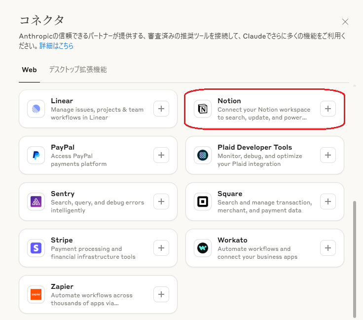

# Roam Research MCP環境構築ガイド（Windows版）


**[English](README.md) | 日本語**

> **📋 このガイドについて**  
> このリポジトリは [2b3pro/roam-research-mcp](https://github.com/2b3pro/roam-research-mcp) の Windows環境での Claude Desktop 連携に関する補足ガイドです。

[](https://opensource.org/licenses/MIT)
[](https://nodejs.org/)
[](https://www.microsoft.com/windows/)

## 🚀 クイックスタート

1. [Roam Research APIトークンを生成](#roam-research側の準備)
2. [Node.jsをインストール](#nodejs環境の構築)
3. [MCPサーバーをセットアップ](#mcpサーバーのインストール)
4. [Claude Desktopを設定](#claude-desktop設定)
5. [動作確認](#動作確認)

## 🔧 解決する問題

- ❌ **JSON解析エラー**: `Unexpected token 'R', "RoamServer"... is not valid JSON`
- ❌ **環境変数エラー**: `Missing required environment variables`  
- ❌ **ESモジュール問題**: `require()` が使用できない問題
- ✅ **安定した Claude Desktop 連携の実現**

第2の脳と飛ばれるノートアプリ`Roam Research`と`Claude Desktop`を`MCP`（`Model Context Protocol`）で連携させる[Roam Research MCP Server](https://github.com/2b3pro/roam-research-mcp)を補足するガイドです。

同じノートアプリに分類されている`Notion`と`Claude Desktop`をつなぐ`MCP`サーバーは、`Anthropic`が信頼するパートナーとして標準的に提供されています。

  

が、[Roam Research](https://roamresearch.com/) の`MCP`サーバーは、現時点では`Anthropic`からは提供されていませんので、`GitHub`の[https://github.com/2b3pro/roam-research-mcp](https://github.com/2b3pro/roam-research-mcp)から入手します。

そして`Installation and Usage`の`Running with Stdio`に従ってインストールするのですが、`Claude Desktop`との連携においていくつかの問題が発生しました。このガイドでは、それらの問題に対応するための具体的な手順を解説しています。

以下に本ガイドの背景と、`2b3pro/roam-research-mcp` リポジトリの設定・手順との主な違いについて説明します。

## ガイド作成の背景

この`Roam Research MCP`サーバーは、AIアシスタント`Claude Desktop`が`Roam Research`グラフにアクセスするための標準化されたインターフェースを提供するものです。`README`には、基本的なセットアップ方法や`Docker`での実行方法、そして`Claude Desktop`との連携に関する`MCP`設定の例が示されています。

しかし実際の試行錯誤の結果、**Windows環境**で`Claude Desktop`と連携させる際に、以下の3つの主要な問題が発生することが確認できました。

1.  **JSON解析エラーの発生**: `MCP`サーバーが`Roam Research`の`API`機能へのアクセスを提供する際、標準入出力 (`Stdio`) を用いた通信が可能です。この際、サーバーから出力されるデバッグメッセージ（`RoamServer: ...` で始まるメッセージ）が、`Claude Desktop`が期待する``JSON-RPC``通信に混入し、「`Unexpected token 'R', "RoamServer"... is not valid JSON`」といったJSON解析エラーを引き起こしました。`Claude Desktop`は標準入力から`JSON-RPC`メッセージを受け取ることを待機しているため、`JSON`以外のデータが送られるとエラーとなります。

2.  **環境変数の読み込み問題**: オリジナルの`README`では、`.env` ファイルを使用して環境変数を設定する方法が推奨されており、サーバーは最初に`.env` ファイルからの読み込みを試み、その後に`MCP`設定の環境変数をフォールバックとして使用すると説明されています。しかし、`Claude Desktop`からサーバーを起動する際に、この`.env`ファイルの読み込みが期待通りに機能しないケースがあり、「`Missing required environment variables`」といった環境変数エラーが発生することがありました。

3. **ESモジュール問題**: プロジェクト内に配置したラッパースクリプトで`require()`が使用できない問題。プロジェクトの`package.json`に`"type": "module"`が設定されているため、プロジェクト内の`.js`ファイルが`ES`モジュールとして扱われ、`CommonJS`形式の`require()`が使用できなくなります。

これらの問題により、`Roam Research MCP`サーバーの強力な機能 を`Claude Desktop`から安定して利用することが困難であったため、その解決策をまとめるためにこのガイドを作成しました。

### オリジナルREADME Installationとの主な違い

このガイドでは、上記の課題を解決するために、オリジナルの`README`に記載されている設定に加えて、以下の重要な変更点と追加手順を導入しています。

1.  **ラッパースクリプトの導入**
    *   **オリジナルのアプローチ**: オリジナルの`README`では、直接 `node build/index.js` コマンドを`MCP`サーバーの設定に記述する形で、サーバーを起動する方法が示されています。この方法では、サーバーが出力するデバッグメッセージが直接`Claude Desktop`に送られてしまいます。
    *   **このガイドでの変更**: デバッグメッセージによる`JSON`解析エラーを回避するため、**ラッパースクリプト**`roam-mcp-wrapper.js`を導入しています。このスクリプトは、`MCP`サーバーからの出力のうち、`RoamServer:` で始まるデバッグメッセージをフィルタリングし、`JSON-RPC`通信のみを標準出力に送信するように機能します。これにより、`Claude Desktop`は予期しない出力に邪魔されることなく、必要な`JSON-RPC`メッセージのみを解析できるようになります。`Claude Desktop`の設定ファイル`claude_desktop_config.json`では、直接サーバーを実行する代わりに、このラッパースクリプトを実行するように設定します。

2.  **環境変数の直接設定**
    *   **オリジナルのアプローチ**: `README`では、開発時において`.env`ファイルの使用が推奨されており、サーバーは`.env`ファイルを優先して環境変数をロードすると述べられています。また、`MCP`設定ファイル内の`env`プロパティでも設定可能です。
    *   **このガイドでの変更**: `Claude Desktop`との連携において、`.env`ファイルの読み込みが安定しない問題を回避するため、**`ROAM_API_TOKEN`** や **`ROAM_GRAPH_NAME`** などの必須環境変数を、`Claude Desktop`の**設定ファイル `claude_desktop_config.json` 内の `env` プロパティに直接記述する**ことを推奨しています。これにより、サーバー起動時に環境変数が確実に`Claude Desktop`から渡されるようになり、環境変数エラーの発生を防ぎます。

3. **MCP専用ディレクトリの採用**
   * **オリジナルのアプローチ**: `README`では、プロジェクト内またはシステムの適当な場所にファイルを配置する方法が示されています。この方法では、プロジェクトの`package.json`設定の影響を受ける可能性があります。
   * **このガイドでの変更**: `ES`モジュール問題を根本的に回避し、複数の`MCP`サーバーを効率的に管理するため、**プロジェクト外の専用ディレクトリ構成**`C:\Users\%USERNAME%\mcp-servers\`を採用しています。この構成により、各`MCP`サーバーが独立して動作し、`package.json`の`"type": "module"`設定の影響を受けることなく、ラッパースクリプトで`require()`を安全に使用できます。また、将来的に他の`MCP`サーバー（`Notion`、`Obsidian`等）を追加する際の拡張性も確保されています。

これらの変更点、特に**ラッパースクリプトによるデバッグ出力のフィルタリング**と`Claude Desktop`設定での**環境変数の直接設定**が、本ガイドが提供する安定動作の鍵となります。

このガイドは、これらの問題を解決し、`Roam Research MCP`サーバーと`Claude Desktop`が`Windows`環境で安定して連携できるようにするための、実際の試行錯誤から得られた知見をまとめたものです。

## 目次

1. [前提条件](#前提条件)
2. [Roam Research側の準備](#roam-research側の準備)
3. [Node.js環境の構築](#nodejs環境の構築)
4. [MCPサーバーのインストール](#mcpサーバーのインストール)
5. [Claude Desktop設定](#claude-desktop設定)
6. [動作確認](#動作確認)

## 前提条件

- **Roam Research**: アクティブな有料アカウント（`API`アクセス権限必須）
- **Claude Desktop**: 最新版のインストール
- **OS**: Windows11
- **Node.js**: v18.0以上（推奨: v20.0以上）
- **管理者権限**: インストール時に必要

## Roam Research側の準備

### 1. APIトークンの生成

1. `Roam Research` にログイン
2. 右上の3点リーダーから設定（⚙️）をクリック
  
3. 「`Graph`」タブを選択
4. 「`API tokens`」セクションに移動
5. 「`+ New API Token`」をクリック
6. 権限を設定：
    - ☑️ **Read+edit**: グラフの読み取り、ページ・ブロックの作成・編集
7. トークン名を入力
8. 「`Create token`」をクリック
  
9. **⚠️ 重要**: 生成されたトークンをコピーして安全な場所に保存
    - この画面を閉じると再度確認できません

### 2. グラフ名の確認

1. `Roam Research`のダッシュボードで使用したいグラフを開く
2. `URL`の`https://roamresearch.com/#/app/[グラフ名]`の部分を確認

## Node.js環境の構築

1. [Node.js公式サイト](https://nodejs.org/)から`LTS`版をダウンロード
2. インストーラーを実行してデフォルト設定でインストール
3. コマンドプロンプトで確認：

### 1. インストール確認

```cmd
>node --version
v22.14.0

>npm --version
10.9.2
```

## MCPサーバーのインストール

### MCP専用ディレクトリの作成（推奨）

複数の`MCP`サーバーを管理するため、専用ディレクトリ構成を採用します。この方法により、各`MCP`サーバーを独立して管理でき、将来的な拡張も容易になります。

#### 1. ディレクトリ構成の作成

```bash
# MCP専用のルートディレクトリを作成
mkdir C:\Users\%USERNAME%\mcp-servers

# Roam Research専用ディレクトリを作成
mkdir C:\Users\%USERNAME%\mcp-servers\roam-research
```

**推奨ディレクトリ構成:**

```text
C:\Users\%USERNAME%\mcp-servers\
├── roam-research\
│   ├── roam-mcp-wrapper.js    # ラッパースクリプト
│   └── README.md              # 設定メモ（オプション）
├── notion\                    # 将来の追加用
├── obsidian\                  # 将来の追加用
└── shared\                    # 共通ユーティリティ用
```

#### 2. メリット

- ✅ **各MCPサーバーの独立管理**: 設定ファイルとスクリプトの分離
- ✅ **スケーラビリティ**: 新しい`MCP`サーバーを簡単に追加
- ✅ **トラブルシューティング**: 問題の切り分けが容易
- ✅ **ESモジュール問題の回避**: プロジェクト外配置で`CommonJS`利用可能

### Roam Research MCPサーバーのセットアップ

#### 1. ソースからビルド（開発者向け）

```bash
# 作業ディレクトリでリポジトリをクローン
git clone https://github.com/2b3pro/roam-research-mcp.git
cd roam-research-mcp

# 依存関係をインストール
npm install

# TypeScriptをビルド（Windowsの場合はcpコマンドがエラーになるので手動コピーが必要）
npx tsc
copy Roam_Markdown_Cheatsheet.md build\Roam_Markdown_Cheatsheet.md

# ビルド確認
dir build\index.js
```

#### 2. グローバルインストール（推奨）

```bash
# NPMからグローバルインストール
npm install -g roam-research-mcp

# インストール場所の確認
where roam-research-mcp
```

**注意**: グローバルインストール後、通常は以下の場所にビルドファイルが配置されます：

```shell
C:\Users\%USERNAME%\AppData\Roaming\npm\node_modules\roam-research-mcp\build\index.js
```

### ラッパースクリプトの作成

#### 1. ESモジュール問題とJSON解析エラーの対策

直接`MCP`サーバーを実行すると、以下の問題が発生します：

1. **JSON解析エラー**: `RoamServer:`デバッグメッセージが`JSON-RPC`通信を妨害
2. **環境変数エラー**: `.env`ファイルの読み込みが不安定

これらを解決するため、ラッパースクリプトを作成します。

#### 2. ラッパースクリプトの作成

**テンプレートをコピー**:

   ```bash
   cp scripts/roam-mcp-wrapper.js.template C:\Users\%USERNAME%\mcp-servers\roam-research\roam-mcp-wrapper.js
   ```

**環境変数を設定**:
作成したファイルを編集し、以下の値を実際の値に置き換えてください：

- ROAM_API_TOKEN: あなたのAPIトークン
- ROAM_GRAPH_NAME: あなたのグラフ名
- require()のパス: 実際のユーザー名に変更

詳細な設定内容は `scripts/roam-mcp-wrapper.js.template` を参照してください。

### 環境変数の管理について

このガイドでは、環境変数をラッパースクリプト内で直接設定する方法を採用しています。

**直接設定を選ぶ理由:**

- ✅ シンプルで確実な動作
- ✅ 外部ファイル読み込みエラーの回避
- ✅ 設定の一元管理
- ✅  `.env`ファイル読み込み問題の回避

**注意**: 本番環境では`.env`ファイルや`OS`の環境変数を使用することを推奨しますが、`Claude Desktop`環境では直接設定が最も安定しているようです。**ファイル共有時はAPIトークンを必ず削除してください。**

### 重要な設定項目

1. **APIトークンとグラフ名の設定**:

    ```javascript
    process.env.ROAM_API_TOKEN = "roam-graph-token-StBlb-あなたのトークン";
    process.env.ROAM_GRAPH_NAME = "あなたのグラフ名";
    ```

2. **requireパスの確認**:
   グローバルインストールの場合、通常は以下のパス：

    ```javascript
    // 注意: 以下のパスは実際のユーザー名に置き換えてください
    require('C:/Users/[USERNAME]/AppData/Roaming/npm/node_modules/roam-research-mcp/build/index.js');
    ```

### ラッパースクリプトの動作テスト

```bash
# ディレクトリに移動
cd C:\Users\%USERNAME%\mcp-servers\roam-research

# ラッパースクリプトのテスト実行
node roam-mcp-wrapper.js
```

**期待される結果**:

- ✅ エラーメッセージが表示されない
- ✅ プロセスが待機状態になる（応答なし）
- ✅ `Ctrl+C`で終了できる

**注意**: 応答がないのは正常な動作です。`MCP`サーバーは`JSON-RPC`通信を待機している状態です。

## Claude Desktop設定

### 1. 設定ファイルの場所

```bash
%APPDATA%\Claude\claude_desktop_config.json
```

### 2. 設定ファイルの更新

`MCP`専用ディレクトリに配置したラッパースクリプトを使用するよう設定します。

#### 設定例

```json
{
  "mcpServers": {
    "roam-research": {
      "command": "node",
      "args": [
        "C:/Users/[USERNAME]/mcp-servers/roam-research/roam-mcp-wrapper.js"
      ]
    }
  }
}
```

#### 既存の設定がある場合

他の`MCP`サーバーと併用する場合の設定例：

```json
{
  "mcpServers": {
    "roam-research": {
      "command": "node",
      "args": [
        "C:/Users/[USERNAME]/mcp-servers/roam-research/roam-mcp-wrapper.js"
      ]
    },
    "filesystem": {
      "command": "npx",
      "args": [
        "-y",
        "@modelcontextprotocol/server-filesystem",
        "C:/Users/%USERNAME%/Documents"
      ]
    },
    "github": {
      "command": "npx",
      "args": [
        "-y",
        "@modelcontextprotocol/server-github"
      ],
      "env": {
        "GITHUB_PERSONAL_ACCESS_TOKEN": "${GITHUB_TOKEN}"
      }
    }
  }
}
```

### 3. 従来の方法との比較

#### このガイドでの推奨方法（新）

```json
"roam-research": {
  "command": "node",
  "args": [
    "C:/Users/[USERNAME]/mcp-servers/roam-research/roam-mcp-wrapper.js"
  ]
}
```

**メリット**:

- ✅ `JSON`解析エラーの回避
- ✅ 環境変数の確実な設定
- ✅ デバッグメッセージのフィルタリング
- ✅ 複数`MCP`サーバーの管理が容易

#### 従来の直接実行方法（非推奨）

```json
"roam-research": {
  "command": "node",
  "args": ["/path/to/roam-research-mcp/build/index.js"],
  "env": {
    "ROAM_API_TOKEN": "your-api-token",
    "ROAM_GRAPH_NAME": "your-graph-name"
  }
}
```

**問題点**:

- ❌ `JSON`解析エラーが発生
- ❌ 環境変数の読み込みが不安定
- ❌ デバッグメッセージが`Claude Desktop`に送信される

### 4. 設定の検証

設定ファイルを保存後、以下で構文エラーがないか確認：

```bash
# JSON構文の検証（PowerShellの場合）
Get-Content "$env:APPDATA\Claude\claude_desktop_config.json" | ConvertFrom-Json
```

成功すれば設定ファイルが正しく記述されています。

## 動作確認

### 1. ステップバイステップの動作確認

#### Step 1: ラッパースクリプトの単体テスト

```bash
# ディレクトリに移動
cd C:\Users\%USERNAME%\mcp-servers\roam-research

# ラッパースクリプトの単体実行
node roam-mcp-wrapper.js
```

**期待される結果**:

- ✅ エラーメッセージが表示されない
- ✅ プロセスが待機状態になる（無応答）
- ✅ `Ctrl+C`で正常に終了できる

**重要**: 無応答は正常な動作です。`MCP`サーバーは`JSON-RPC`通信を待機している状態です。

#### Step 2: Claude Desktopの完全再起動

1. **完全終了**:

    ```bash
    # タスクマネージャーでClaude関連プロセスを全て終了
    # または
    taskkill /f /im "Claude.exe"
    ```

2. **再起動**: 通常通り`Claude Desktop`を起動

#### Step 3: 接続確認

1. **起動時のエラーチェック**:

- 起動時に`JSON`解析エラーが出ないことを確認
- 環境変数エラーが出ないことを確認

2. **新しいチャットでの機能テスト**:

   ```
   Roam Researchに接続できていますか？利用可能な機能を教えてください。
   ```

### 2. 成功の確認方法

#### 視覚的確認

- ✅ **起動許可ダイアログが表示される**
- ✅ **左サイドバーにMCPサーバー一覧が表示される**
  - `roam-research` が利用可能なツール数と共に表示される
  - 例：`roam-research` (18) ← 数字は利用可能なツール数
- ✅ `Roam Research`の基本操作（検索、作成）ができる
- ✅ エラーメッセージが表示されない
- ✅ レスポンスが適切に返ってくる

#### 機能確認テスト

**基本接続テスト**:

```prompt
Roam Researchに接続できていますか？利用可能な機能を教えてください。
```

**検索機能テスト**:

```prompt
今日作成されたページを教えてください
```

**キーワード検索テスト**:

```prompt
「プロジェクト」というキーワードでページを検索してください
```

### 3. トラブルシューティング

#### よくある問題と解決方法

##### 問題1: JSON解析エラー

```shell
Unexpected token 'R', "RoamServer"... is not valid JSON
```

**原因**: デバッグメッセージが`JSON-RPC`通信に混入
**解決策**: ラッパースクリプトが正しく動作していることを確認

##### 問題2: 環境変数エラー

```shell
Missing required environment variables: ROAM_API_TOKEN, ROAM_GRAPH_NAME
```

**原因**: `API`トークンまたはグラフ名が未設定
**解決策**: ラッパースクリプト内の環境変数を確認・修正

##### 問題3: ファイルが見つからないエラー

```shell
Cannot find module 'C:/Users/.../roam-research-mcp/build/index.js'
```

**原因**: `require`パスが間違っている
**解決策**: グローバルインストール場所を確認

```bash
# インストール場所の確認
where roam-research-mcp
npm list -g roam-research-mcp
```

#### ログファイルの確認

**ログファイルの場所**:

```bash
%LOCALAPPDATA%\Claude\logs\mcp-server-roam-research.log
```

**ログの確認方法**:

```bash
# 最新のログを確認
type "%LOCALAPPDATA%\Claude\logs\mcp-server-roam-research.log"

# エラーのみを抽出
type "%LOCALAPPDATA%\Claude\logs\mcp-server-roam-research.log" | findstr /i error
```

## 解決できた問題まとめ

今回のアプローチにより、以下の問題が解決されました：

- ✅ **JSON解析エラーの解消**: `Unexpected token 'R', "RoamServer"... is not valid JSON`
- ✅ **環境変数エラーの解消**: `Missing required environment variables`
- ✅ **ESモジュール問題の回避**: プロジェクト外配置によりCommonJS利用可能
- ✅ **デバッグ出力のフィルタリング**: `RoamServer:`メッセージの除去

## 解決方法の核心

1. **ラッパースクリプトによるフィルタリング**: デバッグ出力を`JSON-RPC`通信から分離
2. **環境変数の直接設定**: `.env`ファイル読み込み問題を回避
3. **MCP専用ディレクトリ**: プロジェクト外配置で`ES`モジュール問題を回避

この方法により、`MCP`サーバーの機能を損なうことなく、`Claude Desktop`での安定動作を実現できました。

**成功すれば、Claude DesktopからRoam Researchの強力な機能を活用できるようになります！**

## ⚠️ 免責事項

このガイドは [2b3pro/roam-research-mcp](https://github.com/2b3pro/roam-research-mcp) の非公式な補足ガイドです。

- オリジナルの開発者・メンテナーとは関係ありません
- Windows環境での実際の試行錯誤に基づく個人的な解決策です
- 最新情報については必ずオリジナルリポジトリを確認してください

## 📄 ライセンス

このプロジェクトは [MIT License](LICENSE) の下で公開されています。

## 🤝 コントリビューション

改善提案やバグ報告は Issues でお知らせください。プルリクエストも歓迎します。

## 🔗 関連リンク

- [オリジナルリポジトリ](https://github.com/2b3pro/roam-research-mcp)
- [Claude Desktop](https://claude.ai/desktop)
- [Roam Research](https://roamresearch.com/)
- [Model Context Protocol](https://github.com/modelcontextprotocol)

---

*このガイドは実際の試行錯誤を通じて得られた知見をまとめたものです。最新の情報については、[公式リポジトリ](https://github.com/2b3pro/roam-research-mcp)を確認してください。*

---
2025/07/28 keides2 初版
